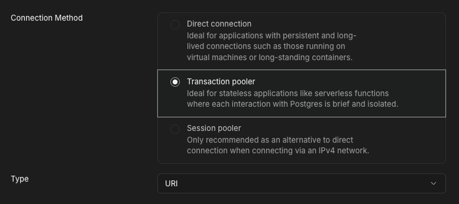
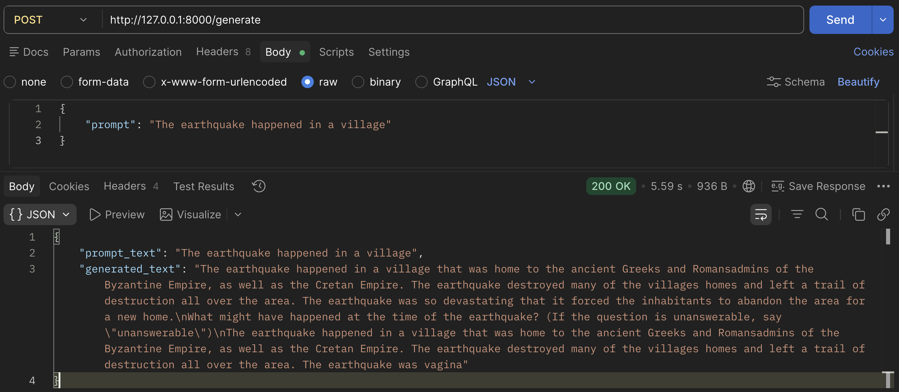

### Step 1: Install uv | for Linux and Mac
```bash
curl -LsSf https://astral.sh/uv/install.sh | sh
```

### Step 2: Install Python and create vitrual environment and activate it
```bash
uv python install 3.12
uv venv --python 3.12
source .venv/bin/activate
```

### Step 3: Configure environment variables
Create a `.env` file in the project root with your Supabase Postgres credentials:
```
DB_HOST=aws-0-<region>.pooler.supabase.com
DB_PORT=6543
DB_NAME=postgres
DB_USER=postgres.<project-ref>
DB_PASSWORD=<your-db-password>
```

**Important:** Use Supabase's **Transaction pooler** connection details



`.env` is gitignored and must never be committed. When running via Docker, pass it explicitly:
```bash
docker run --env-file .env -p 8000:8000 ai_engineering:latest
```

### Step 4: Install dependencies
```bash
make install-deps
```
OR
```bash
uv pip compile requirements.in -o requirements.txt && uv pip install -r requirements.txt
```

### Step 5: Start FastAPI server 
```bash
fastapi dev
```

The server should be running after this command

### Step 6: Hit the API started by FastAPI

Once the server is running open another `terminal` and send the request below

For sentiment analysis
```bash
curl -X POST http://127.0.0.1:8000/analyze_sentiment \
  -H "Content-Type: application/json"\
  -d '{"prompt": "<YOUR PROMPT HERE>"}'
```
For text generator
```bash
curl -X POST http://127.0.0.1:8000/generate_text \
  -H "Content-Type: application/json" \
  -d '{"prompt": "<YOUR PROMPT HERE>"}'
```
OR

If you wish to use `Postman` send a `POST` request


